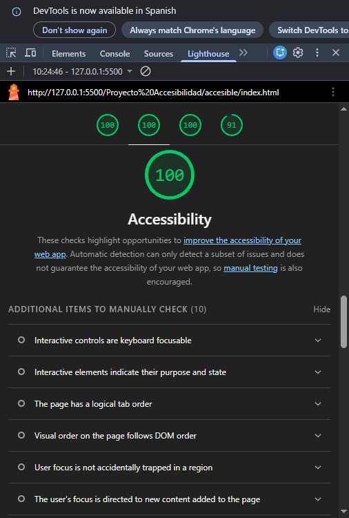
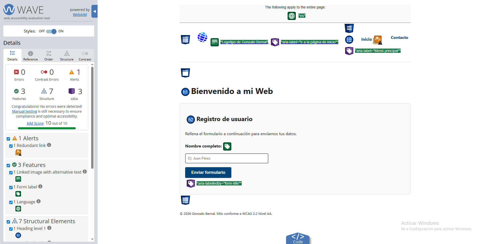
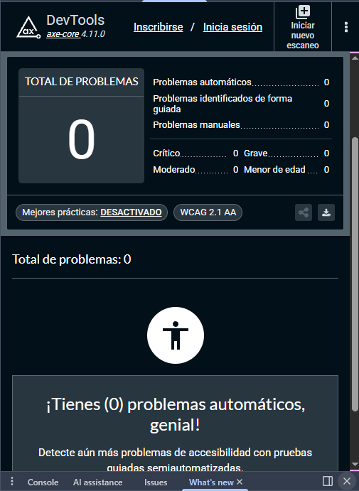

# 🚀 Accessibility Refactor (WCAG 2.2)

  

---

## 🇪🇸 Versión en Español

### 📋 Resumen
Refactorización de una web legacy para cumplir con el **100% de WCAG 2.2 (AA/AAA)** mediante Ingeniería de Prompts y validación técnica.

### 🛠️ Problemas y Soluciones
| Elemento | Solución | Criterio |
| :--- | :--- | :--- |
| `div` Botón | `<button>` Nativo | 4.1.2 Name, Role, Value |
| Sin `alt` | Atributo `alt` descriptivo | 1.1.1 Non-text Content |
| Contraste | Ratio **7:1 (AAA)** | 1.4.6 Contrast |
| Estructura | Semántica HTML5 | 1.3.1 Info & Relations |

### 📸 Evidencia de Validación
| Lighthouse (100%) | WAVE (0 Errors) | Axe DevTools (Clean) |
| :---: | :---: | :---: |
|  |  |  |

---

## 🇺🇸 English Version

### 📋 Summary
Legacy web refactor to achieve **100% WCAG 2.2 (AA/AAA)** compliance using Prompt Engineering and technical validation.

### 🛠️ Issues & Solutions
| Element | Solution | Criterion |
| :--- | :--- | :--- |
| `div` Button | Native `<button>` | 4.1.2 Name, Role, Value |
| Missing `alt` | Descriptive `alt` text | 1.1.1 Non-text Content |
| Contrast | **7:1 Ratio (AAA)** | 1.4.6 Contrast |
| Structure | HTML5 Semantics | 1.3.1 Info & Relations |

### 📸 Validation Evidence
| Lighthouse (100%) | WAVE (0 Errors) | Axe DevTools (Clean) |
| :---: | :---: | :---: |
|  |  |  |

---

### 🧰 Tools / Herramientas
* **IA:** Google Gemini
* **Testing:** WAVE, Lighthouse, Axe DevTools
* **Editor:** VS Code + Live Server